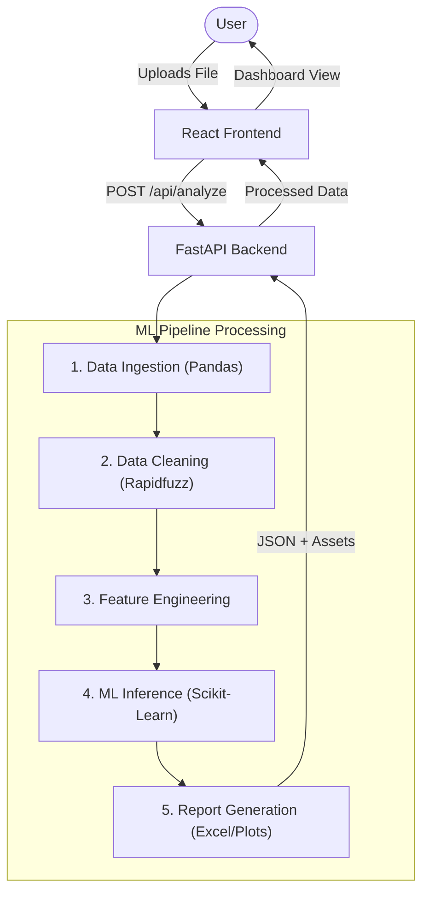
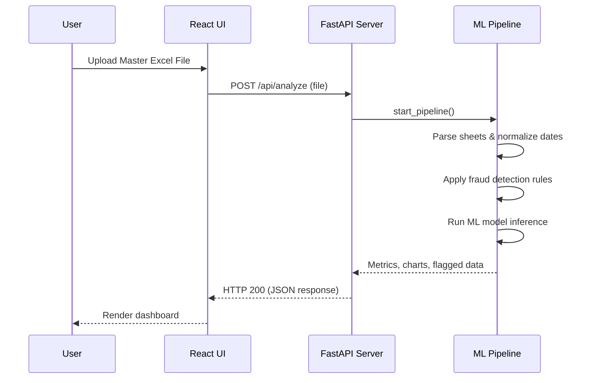

# ProcureShield AI - Application Architecture

## 1. System Overview
The ProcureShield AI application wraps a comprehensive data science and machine learning pipeline (originally developed in a Jupyter Notebook) into a robust, production-ready full-stack web application. It allows users to upload procurement data (invoices, POs, GRNs, Rate Cards), processes the data to detect anomalies and fraud, and presents the findings through an interactive dashboard and detailed reports.

---

## 2. Technology Stack

### Frontend
- **Framework:** ReactJS 18+ (via Vite)
- **Language:** TypeScript
- **Styling:** Tailwind CSS / standard CSS (already present in `src/`)
- **Routing:** React Router (to handle Dashboard and Upload views)
- **Data Fetching:** Fetch API / Axios
- **Visualization:** Recharts (or rendering backend-generated Matplotlib images)

### Backend
- **Framework:** FastAPI
- **Language:** Python 3.12+ 
- **Server:** Uvicorn
- **File Parsing & ML Pipeline:** 
  - `pandas` (Data manipulation)
  - `openpyxl` (Excel reading/writing)
  - `scikit-learn` (Random Forest Classifier & ML metrics)
  - `rapidfuzz` (Fuzzy string matching for vendor names)
  - `matplotlib` & `seaborn` (Chart generation)
  - `numpy` (Numerical operations)

---

## 3. High-Level Data Flow

### Architecture Flow Diagram



### Process Sequence Diagram



### Data Processing Steps

1. **User Interaction (Frontend):** The user accesses the web application and uploads the Master Excel file containing all data sheets (`PO Register`, `GRN Register`, `Invoice Register`, `Rate Card Master`).
2. **API Request:** The React frontend sends a `POST` request to the FastAPI backend (`/api/analyze`) acting as a `multipart/form-data` payload.
3. **Data Ingestion & Cleaning (Backend):** 
   - Backend reads the Excel file into memory using `pandas` and `openpyxl`.
   - Date formats are normalized.
   - Vendor names are standardized using `rapidfuzz`.
4. **Feature Engineering & Module Processing (Backend):**
   - Lookup dictionaries are built.
   - The 4 core fraud detection modules (Duplicate, Rate Mismatch, Ghost Invoice, 3-Way Match) process the data to generate individual risk scores.
   - A unified Risk Score (0-100) is calculated based on module weights.
5. **Machine Learning Inference (Backend):**
   - Engineered features are passed through a `scikit-learn` Random Forest Classifier.
   - Predictions, confidence intervals, and feature importance metrics are generated.
6. **Report & Chart Generation (Backend):**
   - Business impact logic determines "Risk Amount" and "Recovered Amount".
   - `matplotlib` is utilized to generate summary visual charts.
   - An output Excel report (`ProcureShield_AI_Report.xlsx`) is generated and temporarily saved.
7. **API Response:** The `/api/analyze` endpoint responds with a JSON payload containing pipeline summary metrics, aggregated scores, and metadata for the generated charts/reports.
8. **Visualization (Frontend):** The React Dashboard receives the JSON and dynamically updates the UI to show key metrics, risk zones, and a paginated table of flagged invoices.

---

## 4. Backend Architecture Details

**Directory Structure:**
```text
backend/
├── main.py                  # FastAPI application setup, middleware, and route definitions
├── requirements.txt         # Python dependencies
├── models/
│   └── api_models.py        # Pydantic schemas for request/response validation
├── services/
│   ├── pipeline.py          # Ported ML pipeline (ingest, clean, feature engineering)
│   ├── ml_model.py          # Scikit-learn model loading, training/inference logic
│   └── report_engine.py     # Excel export and matplotlib chart generation
└── storage/                 # Temporary directory for uploaded files and outputs
```

**Key API Endpoints:**
- `POST /api/analyze`: Main endpoint. Accepts Excel file upload, orchestrates pipeline execution, and returns summary JSON.
- `GET /api/reports/download`: Serves the generated `ProcureShield_AI_Report.xlsx` file as an attachment.
- `GET /api/charts/{chart_name}`: Serves the generated EDA and ROI charts as static image assets for frontend consumption.

---

## 5. Frontend Architecture Details

**Directory Structure:**
```text
src/
├── assets/                  # Static assets (images, icons)
├── components/              # Reusable UI components (Buttons, Modals, Cards)
│   ├── DashboardStats.tsx
│   ├── DataCharts.tsx
│   ├── FileUploader.tsx
│   └── InvoiceTable.tsx
├── pages/                   # Page-level components
│   ├── Home.tsx             # Landing/Upload page
│   └── Dashboard.tsx        # Results visualization page
├── services/
│   └── api.ts               # Axios/Fetch API wrapper functions to interact with FastAPI
├── types/
│   └── index.ts             # TypeScript interfaces matching backend Pydantic models
├── App.tsx                  # Main application component & routing setup
└── main.tsx                 # Entry point
```

**State Management & Lifecycle:**
- Use standard React Hooks (`useState`, `useEffect`) context API if necessary.
- **Loading States:** Crucial for the `FileUploader` since the inference pipeline takes ~30 seconds to run. A progress stepper (Upload -> Clean -> ML Inference -> Report) can be implemented to improve UX.

---

## 6. Integration and Deployment Considerations

- **CORS:** FastAPI must be configured with `CORSMiddleware` to allow requests from the React development server (typically `localhost:5173`).
- **Temporary State Management:** Since FastAPI processes files dynamically, uploaded files and resulting reports/charts should either be kept in memory or safely cleaned up from the local `storage/` directory after use.
- **Model Persistency:** For production speed, the Random Forest model could be pre-trained and saved as a `.pkl` or `.joblib` file instead of training per-upload. Initially, it will train dynamically to mirror the notebook's behavior exactly, but can be configured to load from disk.
